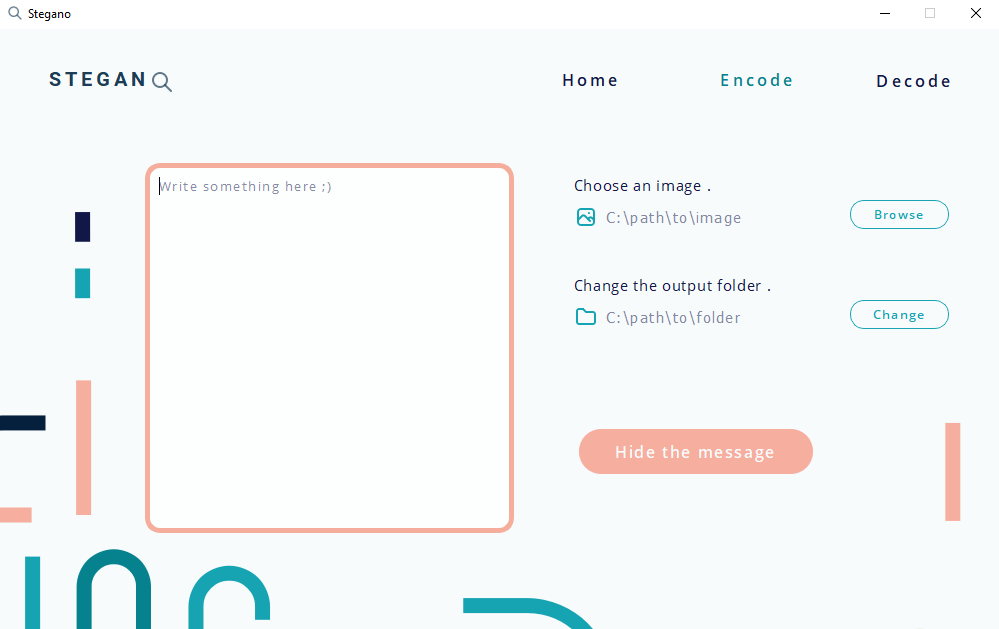

# STEGANO APP

This is a desktop application that allows you to hide a message inside an image and decode it.
It's based on what we called [steganography](https://en.wikipedia.org/wiki/Steganography)

**You can download the executable file [here](https://drive.google.com/drive/folders/1Jth5vjjfRfK3MM6LQDjcp4OAo4ATaJmh?usp=sharing)**

**Important:** If some functionalities aren't working , try to disable your avast antivirus temporarily. We are working on this issue.

**Warning**: Make sure the display scaling system in your windows settings is 100% 

# Description

## requirements:

if you want to run the source code avaible in this repository , make sure you have:

* opencv2 `pip install opencv-python`
* pyqt5 `pip install pyqt5`
* pyqt5-tools `pip install pyqt5-tools`
* numpy

## The user interface

The ui is made in Adobe Xd 

## Global view

After installing **stegano_setup.exe** , if you run the .exe file , this window will appear showing you the home page:

In the navbar , you can access the encode page :

**The steps are easy:**

1. Write the message you want to hide
2. Choose the image you want. It will contains the hidden message *(it's preferable to choose a png image)*
3. Change the output folder where the encoded image will be created 
4. Click the button **Hide the message** , an image with the name *[original image name]-embedding.png* is now ready to be sent to someone else

After sending the encoded image to another computer or maybe yours , you can decode it by accessing the encode page :

**Note: the receiver must have the stegano-app**

find the the sent image in your computer, and you're done .

**Magic**

## Back-end

If you checked the source_code , you will find in the scripts folder Two files :

* [code_img.py](https://github.com/Ilyas-Khiat/stegano-app/blob/main/scripts/code_img.py)
* [decode_img.py](https://github.com/Ilyas-Khiat/stegano-app/blob/main/scripts/decode_img.py)

I guess it's well explained

## Front-end

Check the [app.py](https://github.com/Ilyas-Khiat/stegano-app/blob/main/scripts/app.py) file

Contact me here : *kiatdotblend@gmail.com*

### HAVE FUN :) 
Hope it works

